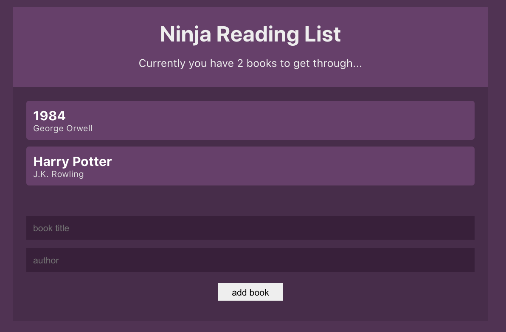

# reading-list

This is a book reading list app using react context hooks. The App has a bookContext that is use to managae state across the different components. The App also uses a bookReducer to organize the different functions.

The user can add a book with the name of the book and author. The book will be saved in local storage. The user can also delete the book.



|                                         |                                         |                                                   |
| :-------------------------------------: | :-------------------------------------: | :-----------------------------------------------: |
|      [Introduction](#reading-list)      | [Table of Contents](#table-of-contents) | [Development Highlights](#development-highlights) |
|        [Deployment](#deployment)        |    [Page Directory](#page-directory)    |       [Code Hightlights](#code-highlights)        |
| [Technologies Used](#Technologies-Used) |           [Credits](#Credits)           |                [License](#License)                |

## Development Highlights

- Use React UseContext to globally manage the book state.

- Use React UseReducer to organize the methods for the BookContext.

## Deployment

[Deployment](https://anusontarangkul.github.io/reading-list/)

## Page Directory

The react app contains components in the components directory. The contexts and reducers have their own directory.

## Code Highlights

Use the bookReducer as a reducer to add and remove book.

```JavaScript
export const bookReducer = (state, action) => {
    switch (action.type) {
        case 'ADD_BOOK':
            return [...state, {
                title: action.book.title,
                author: action.book.author,
                id: uuid()
            }]
        case 'REMOVE_BOOK':
            return state.filter(book => book.id !== action.id)
        default:
            return state
    }
}
```

Create a book context the wraps around the book components to manage state.

```JavaScript
export const BookContext = createContext();

const BookContextProvider = (props) => {
    const [books, dispatch] = useReducer(bookReducer, [], () => {
        const localData = localStorage.getItem('books');
        return localData ? JSON.parse(localData) : [];
    })

    useEffect(() => {
        localStorage.setItem('books', JSON.stringify(books))
    }, [books])
    return (
        <BookContext.Provider value={{ books, dispatch }}>
            {props.children}
        </BookContext.Provider>
    )
}
```

## Technologies

### Frontend

- [JavaScript](https://www.javascript.com/)
- [CSS](https://www.w3schools.com/css/)

### Frontend Framework/Library

- [ReactJS](https://reactjs.org/)

### Database

- [localStorage](https://developer.mozilla.org/en-US/docs/Web/API/Window/localStorage)

## Credits

This project was apart of the [The Net Ninja](https://www.youtube.com/watch?v=6RhOzQciVwI&list=PL4cUxeGkcC9hNokByJilPg5g9m2APUePI&index=1) tutorial.

|                           |                                                                                                                                                                                                       |
| ------------------------- | ----------------------------------------------------------------------------------------------------------------------------------------------------------------------------------------------------- |
| **David Anusontarangkul** | [ LinkedIn](https://www.linkedin.com/in/anusontarangkul/) [ GitHub](https://github.com/anusontarangkul) |

## License

[](https://opensource.org/licenses/MIT)
